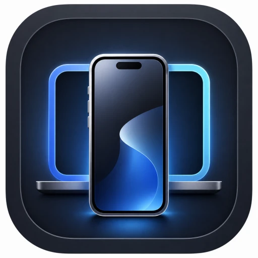
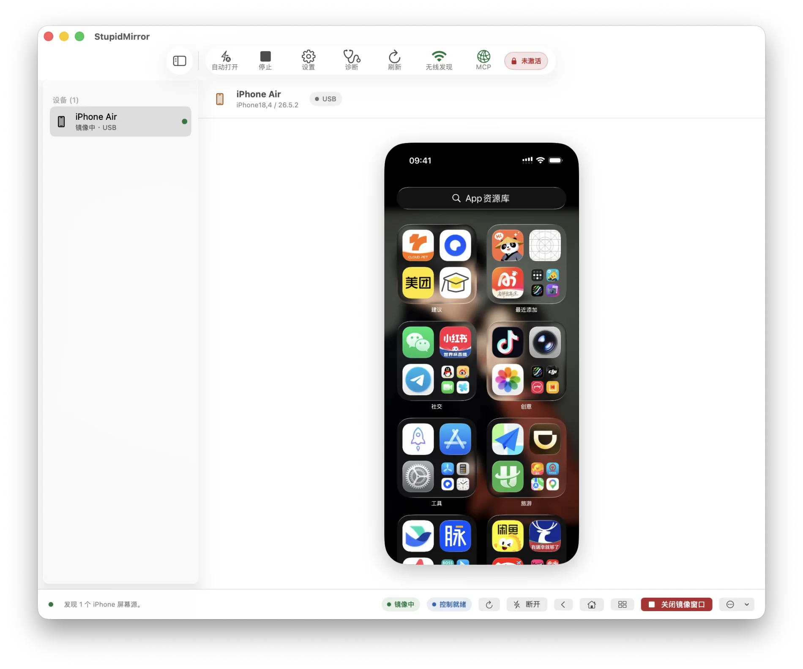

<p align="center">
  
</p>

<h1 align="center">StupidMirror</h1>

<p align="center">
  <strong>Your phone, on your Mac. Your agent, on your phone.</strong><br />
  Native iOS and Android mirroring, device control, and a local MCP server for AI agents.
</p>

<p align="center">
  <a href="Package.swift"></a>
  <a href="https://github.com/LiuTianjie/StupidMirror/actions/workflows/ci.yml"></a>
  <a href="LICENSE"></a>
</p>

<p align="center">
  <a href="https://github.com/LiuTianjie/StupidMirror/releases/latest">Download</a> ·
  <a href="https://liutianjie.github.io/StupidMirror/">Website</a> ·
  <a href="#connect-an-ai-agent">MCP setup</a> ·
  <a href="CHANGELOG.md">Changelog</a> ·
  <a href="README.zh-CN.md">简体中文</a>
</p>

<p align="center">
  
</p>

StupidMirror brings real mobile devices into a native macOS workspace. View an iPhone over USB or Wi-Fi, mirror an Android device through ADB, and interact with either through an explicit control session.

The same workspace is available to AI agents over **MCP**: observe the current screen, locate a target with local OCR or native accessibility, act on the device, and inspect the result. You can watch those actions on the Mac mirror as they happen.

**One device can be mirrored and controlled without signing in.** Account activation unlocks simultaneous devices. The source is available under PolyForm Noncommercial; commercial use requires separate authorization. [License details](#license).

## What makes it useful

- **A native place for your devices.** Menu bar access, a device dashboard, live thumbnails, and independent mirror windows built with SwiftUI and AppKit.
- **Three capture paths.** USB iPhone capture through AVFoundation, wireless iPhone H.264 over the local network, and Android H.264/audio through a pinned scrcpy server.
- **Control when you ask for it.** Tap, swipe, type, press device buttons, switch apps, and launch or terminate apps through Appium. Opening a USB or Android mirror does not start a control session.
- **An agent can see what it is doing.** Live frames, Apple Vision OCR, optional accessibility trees, semantic targeting, waits, and assertions share the same device workspace.
- **Automation stays visible.** Agent taps, swipe paths, and selected targets appear on the Mac mirror. These overlays do not alter the phone screen or encoded video.
- **Bring your own AI client.** Built-in connection guides for Codex and Claude Code. StupidMirror itself needs no model API key and runs no embedded model.

## Start with one device

Download the macOS app from [GitHub Releases](https://github.com/LiuTianjie/StupidMirror/releases/latest), move it to Applications, and open it. StupidMirror runs as a menu bar utility.

| Connection | Prepare | Video and audio |
| --- | --- | --- |
| **iPhone · USB** | Trust this Mac; allow Camera access when requested | AVFoundation capture; optional device audio on the Mac |
| **iPhone · Wi-Fi** | Complete the Wireless Setup Guide once over USB; keep both devices on the same LAN | H.264 over SRT with VideoToolbox decoding; wireless audio is not available |
| **Android · ADB** | Android 11+; install Android SDK Platform-Tools on the Mac; enable USB debugging and approve the Mac's key | H.264 video and optional device audio from scrcpy |

**macOS 15+ is required.** Device compatibility can depend on OS versions, trust state, and the available automation runtime. The project remains experimental.

### iPhone over USB

1. Connect the iPhone, unlock it, and accept **Trust This Computer**.
2. Open StupidMirror and grant Camera access from the in-app permission button.
3. Select the discovered device and open its mirror.

Camera permission is needed because macOS exposes the iPhone screen as an AVFoundation capture source; StupidMirror is not using the Mac webcam for this. **Play Device Audio on Mac** is off by default, preserving playback on the iPhone. Turning it on routes USB device audio to the Mac and also requires Microphone permission.

### iPhone over Wi-Fi

Open the **Wireless Setup Guide** while the phone is connected over USB. The guide checks the device and Apple Development signing identity, prepares the screen runner, and verifies its LAN connection before you unplug.

The phone needs the relevant developer permissions and must accept the Local Network prompt. Later sessions reuse the prepared runner. Wireless mirroring does not require Camera permission or a ReplayKit Broadcast Extension. It does require this signed device-side runner; video setup does not itself enable a control session.

### Android

Install `adb`, enable USB debugging, connect the device, and approve this Mac on the phone. Select the discovered device to start mirroring. Video and audio work independently of the optional Appium control connection.

## Device control

Click **Connect** to start control. Release bundles include the Mac-side Node/Appium runtime and the XCUITest and UiAutomator2 drivers.

| Platform | Control backend | First connection |
| --- | --- | --- |
| iOS | Appium + XCUITest / WebDriverAgent | Requires trust, Developer Mode / UI Automation, and valid Apple Development signing for WebDriverAgentRunner |
| Android | Appium + UiAutomator2 | Installs Appium settings/server helper APKs when needed |

StupidMirror detects usable Apple Development signing teams and reuses per-device WDA build caches. A first build or helper installation takes longer than reconnecting to an existing setup. Advanced settings support a custom Appium endpoint; the default is `http://127.0.0.1:4723`.

## Connect an AI agent

1. Open **Settings → MCP** and enable the local MCP server.
2. Choose **Codex** or **Claude Code** in the connection guide.
3. Copy the generated configuration or command into that client. It includes the endpoint, bearer authentication, and setup timeout.
4. Keep StupidMirror open and ask the agent to call `list_devices`.

The server listens only on `http://127.0.0.1:<port>/mcp`. Rotating the bearer token invalidates the previous credential. First-time control setup can be slow, so the guide configures a 240-second tool timeout.

Try an instruction such as:

> List my connected devices, start mirroring my iPhone, and highlight the visible clickable elements without tapping them.

### Observe → act → verify

| Step | Tools | Behavior |
| --- | --- | --- |
| Connect | `list_devices`, `start_mirror`, `connect_control` | Discover the target and prepare the required sessions |
| Observe | `observe_screen`, `find_any_element` | Read a live frame; use local OCR and request accessibility only when needed |
| Act | `tap_text`, `tap_element`, `replace_text`, `swipe` | Target observed content or an explicit gesture |
| Verify | `wait_for`, `assert_screen`, `observe_screen` | Check the resulting state |
| Guide | `highlight_clickable_elements`, `highlight_elements`, `clear_highlights` | Draw targets on the Mac mirror without sending input |

<details>
<summary>Targeting and text-input details for agent authors</summary>

- Pass `device_id` when more than one device is present.
- `tap_text` accepts up to 16 candidate labels. By default it runs one local OCR pass, then at most one shared native hierarchy snapshot if needed. `find_any_element` performs the lookup without tapping.
- `observe_screen` does not fetch accessibility by default. Use `include_ocr` for local text recognition and `include_accessibility` for explicit hierarchy inspection.
- For icons, canvases, or custom controls, request `include_image: true`, inspect the screenshot, then use an observed coordinate.
- Pass the observation UUID to `tap_element` to reject stale element IDs after the screen changes.
- On iOS, accessibility snapshots can disturb focused text fields. After focusing, use `replace_text` or `clear_text` directly; use `type_text` to append. Replacement and clearing verify the resulting native value.
- Vision OCR supports `fast` and `accurate` modes, defaults to Chinese and English, and runs on demand outside the capture/encoding path.
- Input tools are marked as potentially destructive in MCP metadata because their effect depends on the app currently open on the device.

The [tool definitions](Sources/StupidMirrorApp/StupidMirrorMCPTools.swift) are the authoritative schema.

</details>

## Architecture and privacy

```text
iPhone USB ── AVFoundation ──────────────┐
iPhone LAN ── H.264 / SRT ───────────────┼── Native macOS mirror
Android    ── ADB / scrcpy ──────────────┘        │
                                                  ├── Vision OCR / observations
AI client  ── localhost MCP ── device actions ────┘
                                  │
                         Appium: XCUITest / UiAutomator2
                                  │
                              Real device
```

Capture, playback, and OCR run locally. StupidMirror does not independently upload mirrored content to a model provider. **An external AI client can receive screenshots and tool results through MCP**; its account, model provider, and data settings determine what happens to that information afterward.

Account sign-in and license validation contact the configured Supabase service. License requests contain account/activation data, not mirrored frames or control input. See the [privacy policy](PRIVACY.md) and [security policy](SECURITY.md).

## Build from source

Use macOS 15+ and a Swift 6 toolchain:

```bash
git clone https://github.com/LiuTianjie/StupidMirror.git
cd StupidMirror
make run
```

```bash
swift build        # Compile
swift test         # Run tests
make app           # Create dist/StupidMirror.app
open dist/StupidMirror.app
```

For a host Appium installation, use `make setup-appium` and `make run-appium`. Source execution and packaged apps have separate macOS permission identities; grant permissions to the process you are actually running.

The [probe tools](tools/probes/README.md) help inspect discovery, capture, and WDA readiness. `make probe-avfoundation-frame` saves a local frame under the git-ignored `artifacts/` directory.

## Contributing and documentation

Device bugs are most useful with macOS/device OS versions, connection type, reproduction steps, and redacted diagnostics. Changes to capture or control should include real-device verification; a successful Swift build cannot establish device compatibility.

| Document | Scope |
| --- | --- |
| [Contributing](CONTRIBUTING.md) | Development setup and pull request expectations |
| [Architecture notes](docs/mvp-architecture.md) | Original design and implementation context |
| [Research notes](docs/research.md) | Capture and device-integration research |
| [Release process](RELEASING.md) | Signing, notarization, fixed app identity, and artifact upload |
| [Changelog](CHANGELOG.md) | Release history |
| [Account licensing](LICENSING.md) | Activation, account migration, and licensing infrastructure |

## License

StupidMirror is **source-available** under the [PolyForm Noncommercial License 1.0.0](LICENSE). It permits the noncommercial uses described in that license and is not an OSI-approved open-source license. Commercial use requires separate written authorization; see [commercial licensing](COMMERCIAL-LICENSE.md).

The current app allows one mirror and one control session without activation. To unlock simultaneous devices, sign in with Google, GitHub, or email and redeem an `SM-` activation code from the [official store](https://wzyp.cn/item/exords). iTool `IT-` codes are not accepted. Feature activation and commercial authorization are separate matters.

Third-party components retain their own licenses. See [NOTICE](NOTICE).
